<h2>Shared Folders, Share Permissions, and NTFS Permissions</h2>

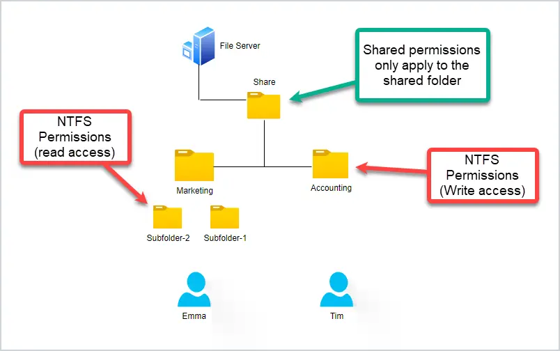

This lab focuses on how shared folders work in a Windows domain environment and how different types of permissions affect what users can do when they access files over the network.

There are two main permission types being demonstrated here:

<ul>
<li><b>Share permissions</b> – these apply when a folder is accessed over the network as a shared folder.</li>
<li><b>NTFS permissions</b> – these apply to the actual files and folders on the disk.</li>
</ul>

A very important idea in this lab is that <b>share permissions apply to the shared folder itself</b>, while <b>NTFS permissions control access inside the folder structure</b>. 
In real environments, administrators often combine both permission types to control exactly who can read, write, or be denied access.

In this project, several folders are being used to simulate different levels of access:

<ul>
<li><b>read-access</b> – a folder intended to allow reading only</li>
<li><b>write-access</b> – a folder intended to allow writing or modifying content</li>
<li><b>no-access</b> – a folder intended to block access</li>
<li><b>accounting</b> – another folder being prepared as part of the file-sharing setup</li>
</ul>

This walkthrough shows how those folders are prepared, shared, and made available across the network so that domain users can test different levels of access.

  

<h3>Creating the Folder Structure on the File System</h3>

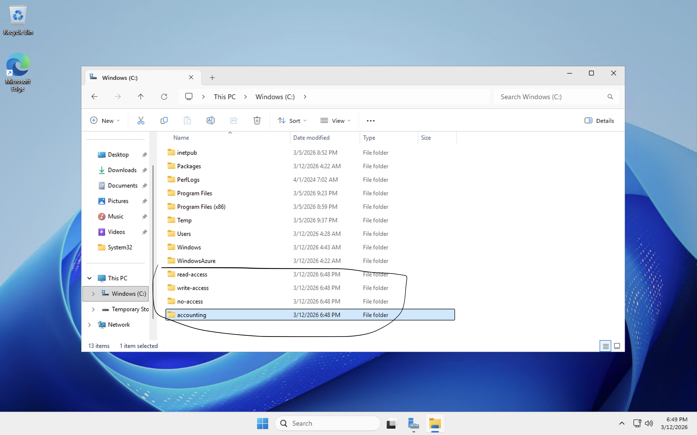

The first step is creating the folders directly on the Windows system drive. 
In this screenshot, File Explorer is open to <b>This PC &gt; Windows (C:)</b>, where several folders have been created:

<ul>
<li><b>read-access</b></li>
<li><b>write-access</b></li>
<li><b>no-access</b></li>
<li><b>accounting</b></li>
</ul>

These folders will later be shared over the network and used to demonstrate how different permission settings affect user access.

Creating the folders first is important because Windows needs an actual local folder before it can be shared with other users on the network.

At this point, the folders exist locally on the machine, but they are not yet available to other users until sharing is configured.

  

<h3>Configuring a Shared Folder With Read Access</h3>

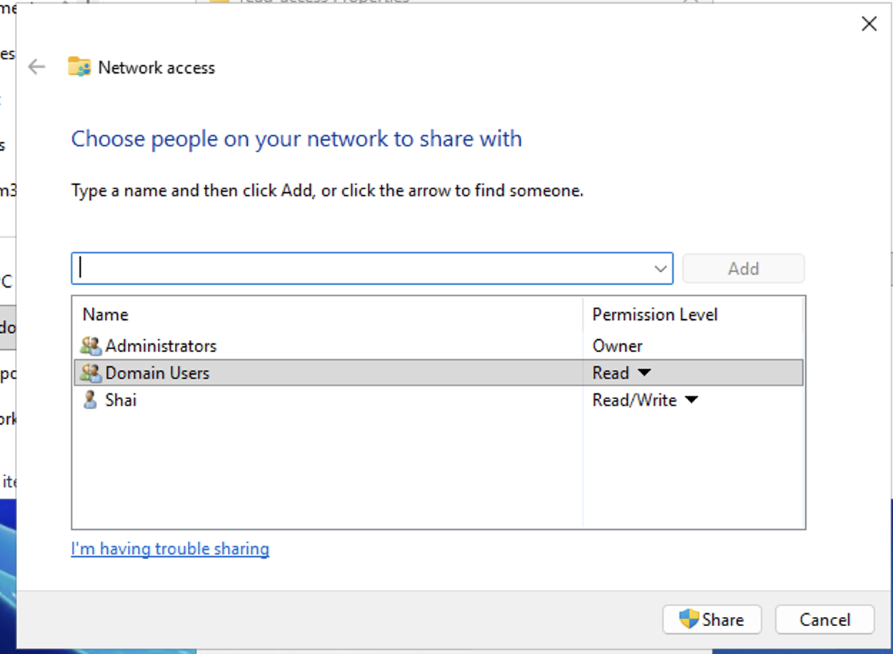

This screenshot shows the <b>Network access</b> sharing window for one of the folders. 
Here, Windows is asking which users or groups on the network should be allowed to access the shared folder.

The listed entries include:

<ul>
<li><b>Administrators</b> – set to <b>Owner</b></li>
<li><b>Domain Users</b> – set to <b>Read</b></li>
<li><b>Shai</b> – set to <b>Read/Write</b></li>
</ul>

This setup means that:

<ul>
<li>Administrators have full control over the share</li>
<li>All domain users can only open and read the contents</li>
<li>The user <b>Shai</b> has additional write capability</li>
</ul>

This is a common setup when a folder needs to be broadly visible to users, but administrators still want to prevent most people from editing the contents.

Notice that this is specifically the <b>share permission</b> stage. 
This controls what happens when users connect to the folder over the network, not necessarily what they can do inside the folder once NTFS permissions are also considered.

  

<h3>Changing the Share Permission to Read/Write</h3>

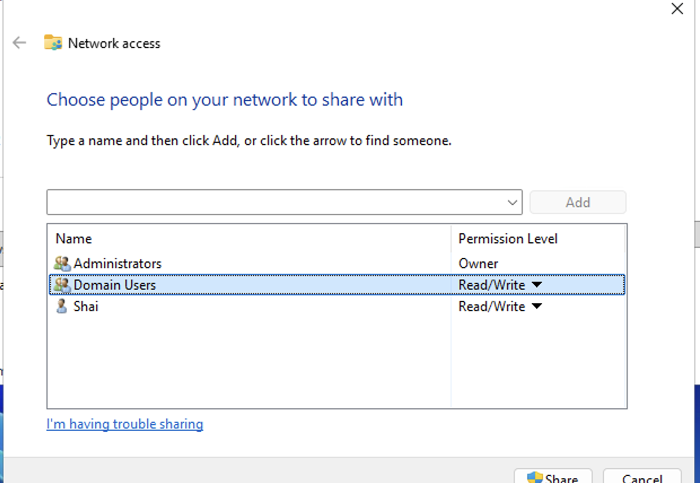

In this step, the share permission for <b>Domain Users</b> has been changed from <b>Read</b> to <b>Read/Write</b>.

This means all domain users who connect to this shared folder over the network will now be allowed to:

<ul>
<li>Open files</li>
<li>Create files</li>
<li>Modify files</li>
<li>Save changes back to the shared folder</li>
</ul>

Administrators often use this type of permission when a folder is meant to be collaborative, such as a team folder where multiple users need to add or edit files.

Even though the share permission now allows writing, the final access a user receives still depends on the folder’s NTFS permissions as well. 
Windows combines both permission systems, and the most restrictive effective access usually wins.

  

<h3>Sharing a Folder With Domain Admins and a Specific User</h3>

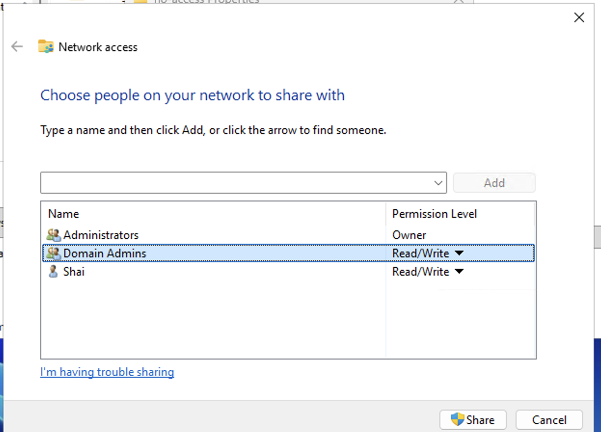

This screenshot shows another variation of the sharing configuration. 
Instead of assigning access broadly to all domain users, the share now includes:

<ul>
<li><b>Administrators</b> – <b>Owner</b></li>
<li><b>Domain Admins</b> – <b>Read/Write</b></li>
<li><b>Shai</b> – <b>Read/Write</b></li>
</ul>

This setup is more restrictive because it does not automatically grant access to every user in the domain. 
Only highly privileged administrators and the specifically listed user are given write access.

This kind of permission structure is useful for sensitive folders, where access should be limited to management, IT staff, or a small group of authorized users.

In enterprise environments, this helps reduce unnecessary exposure and follows the principle of least privilege, meaning users should only receive the minimum access they actually need.

  

<h3>Viewing the Shared Folders From the Network</h3>

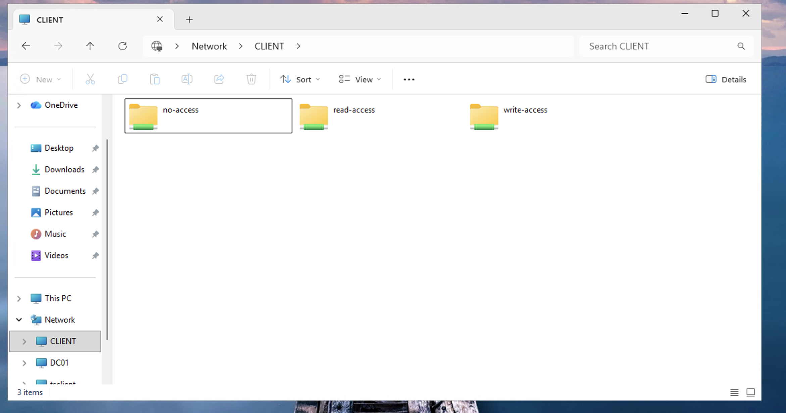

After the folders have been shared, they can be accessed over the network from another system.

In this screenshot, File Explorer is opened to:

<pre>Network &gt; CLIENT</pre>

The shared folders visible on the machine are:

<ul>
<li><b>no-access</b></li>
<li><b>read-access</b></li>
<li><b>write-access</b></li>
</ul>

This confirms that the shares have been successfully published and are now visible to other computers on the network.

At this stage, users can attempt to open these folders and test what level of access they actually have. 
Whether they can only view the contents, create files, edit files, or are denied completely depends on how the <b>share permissions</b> and <b>NTFS permissions</b> were configured.

This is the key goal of the lab: to demonstrate that just because a folder is visible on the network does not automatically mean every user has the same level of access to it.

Visibility and permission are two different things. 
A user may see a shared folder, but once they try to open it or modify something inside it, Windows checks their permissions and either allows or blocks the action.

<h3>Testing Read-Only Access on a Shared Folder</h3>

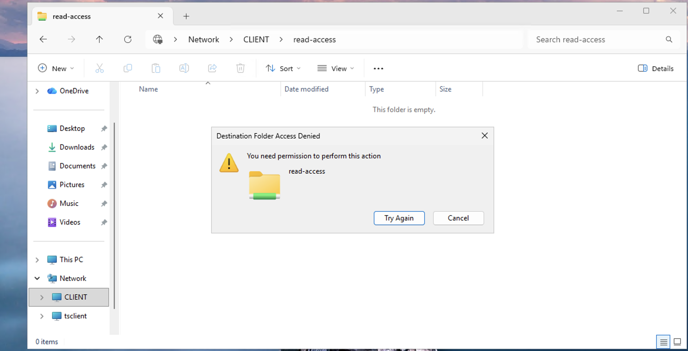

In this step, the shared folder <b>read-access</b> is opened from another machine through the network path:

<pre>Network &gt; CLIENT &gt; read-access</pre>

The user attempts to perform an action that requires modification permissions inside the folder. 
However, because the share and NTFS permissions were configured to allow <b>read-only access</b>, Windows blocks the action.

The message displayed is:

<b>"Destination Folder Access Denied – You need permission to perform this action."</b>

This confirms that the permissions applied to this folder are working correctly. 
Users can open the folder and view its contents, but they cannot create, modify, or delete files.

This type of configuration is commonly used for folders that contain reference documents or files that should not be modified by standard users.

  

<h3>Testing Write Access on a Shared Folder</h3>

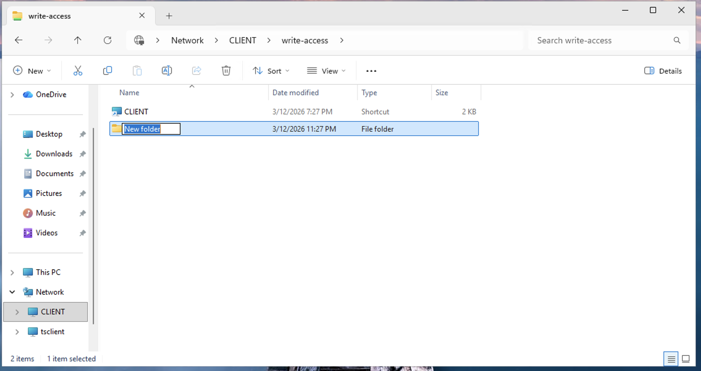

Next, the <b>write-access</b> shared folder is opened through the network path:

<pre>Network &gt; CLIENT &gt; write-access</pre>

Unlike the read-only folder, this shared folder has been configured with permissions that allow users to create and modify files.

In this screenshot, a new folder named <b>New folder</b> is successfully created inside the shared directory.

This demonstrates that both the share permissions and NTFS permissions allow write operations for the current user.

Folders configured this way are often used for collaboration spaces where multiple users need to upload files, edit documents, or organize shared content.

  

<h3>Testing a Folder With No Access</h3>

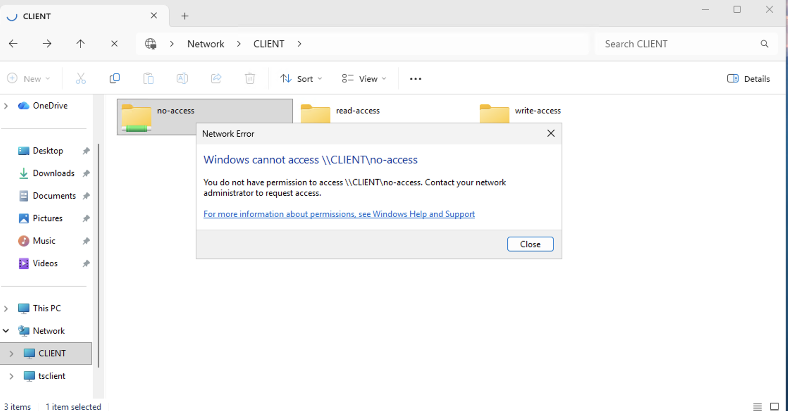

The <b>no-access</b> folder is designed to completely block users from opening the share.

When the user attempts to open the folder from the network path:

<pre>\\CLIENT\no-access</pre>

Windows immediately returns a network error stating:

<b>"Windows cannot access \\CLIENT\no-access. You do not have permission to access this location."</b>

This indicates that the user account does not have the necessary share permissions or NTFS permissions to access the folder.

Blocking access like this is useful when administrators need to restrict sensitive directories from unauthorized users.

  

<h3>Opening Active Directory Users and Computers</h3>

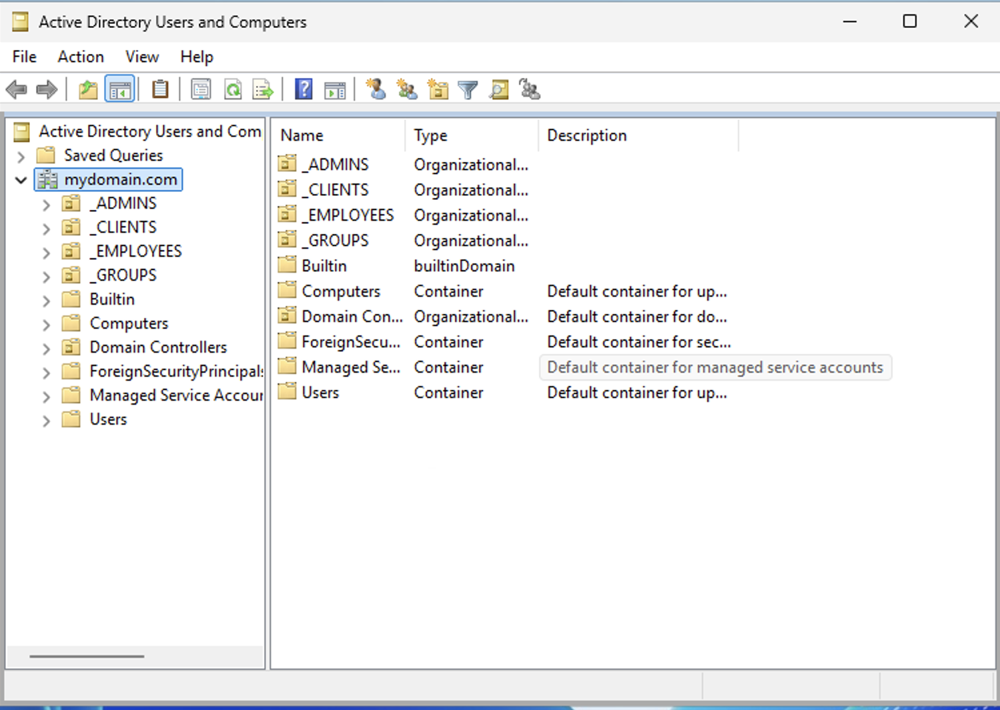

To manage users and groups within the domain, administrators open <b>Active Directory Users and Computers (ADUC)</b>.

In this view, the domain <b>mydomain.com</b> is expanded to display its Organizational Units (OUs), which include:

<ul>
<li><b>_ADMINS</b></li>
<li><b>_CLIENTS</b></li>
<li><b>_EMPLOYEES</b></li>
<li><b>_GROUPS</b></li>
</ul>

Organizational Units are used to logically organize users, computers, and groups within Active Directory.

They help administrators apply policies, manage permissions, and delegate administrative tasks more easily across the domain.

  

<h3>Viewing a Security Group in Active Directory</h3>

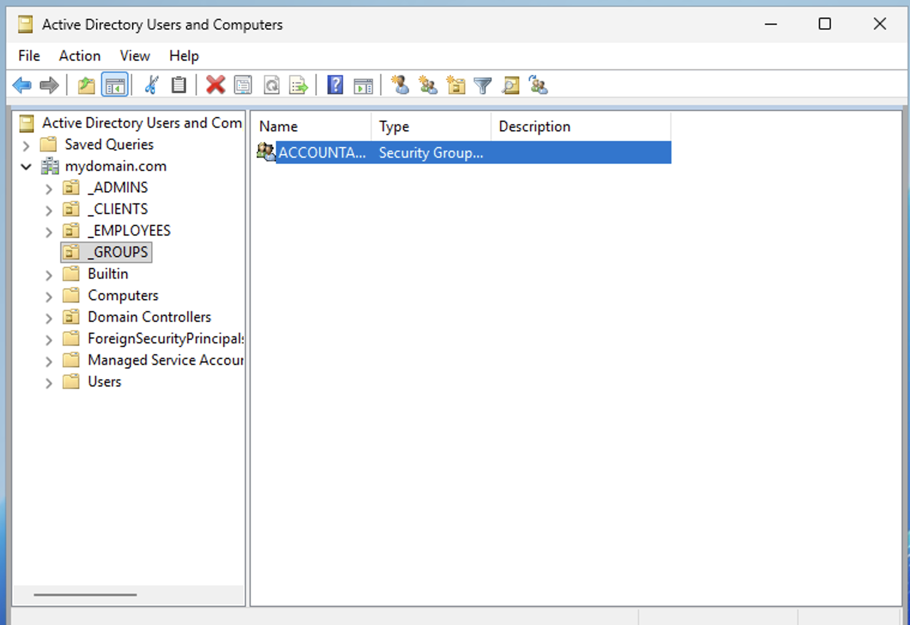

Inside the <b>_GROUPS</b> Organizational Unit, a security group named <b>ACCOUNTANTS</b> is shown.

Security groups are used in Active Directory to manage permissions more efficiently.

Instead of assigning permissions directly to individual users, administrators assign permissions to groups and then add users to those groups.

This approach simplifies access management because administrators only need to modify group membership rather than updating permissions across multiple folders and resources.

  

<h3>Preparing to Assign Permissions Using Security Groups</h3>

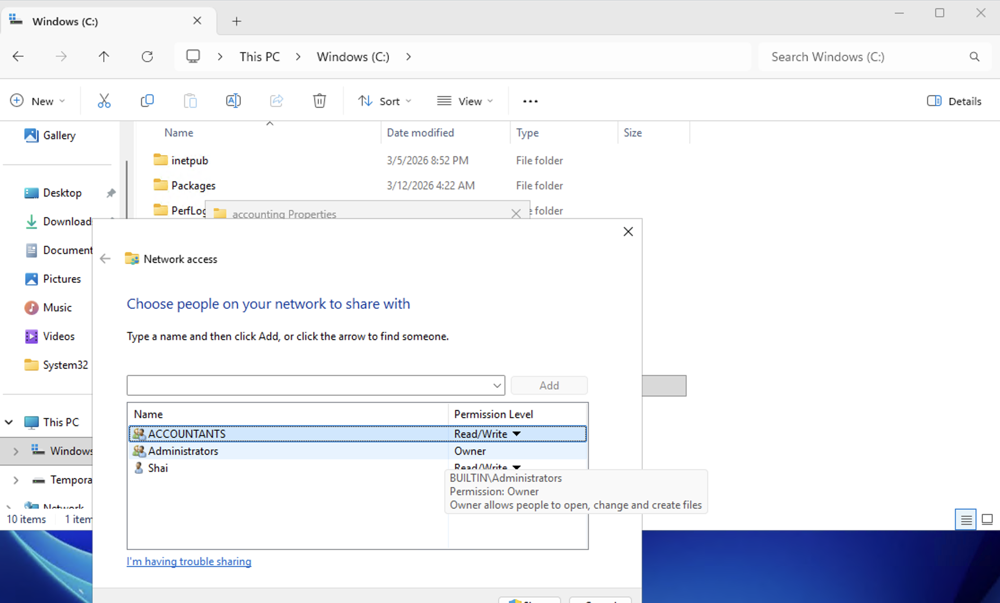

Using groups like <b>ACCOUNTANTS</b>, administrators can assign permissions to shared folders such as the <b>accounting</b> directory.

For example, the accounting department could be granted read/write access to the accounting folder while other users in the organization are restricted from accessing it.

This group-based permission model follows best practices in enterprise environments because it:

<ul>
<li>Reduces administrative workload</li>
<li>Makes permission management easier</li>
<li>Improves security by centralizing access control</li>
</ul>

  

<h3>Assigning the Accounting Group to a Shared Folder</h3>

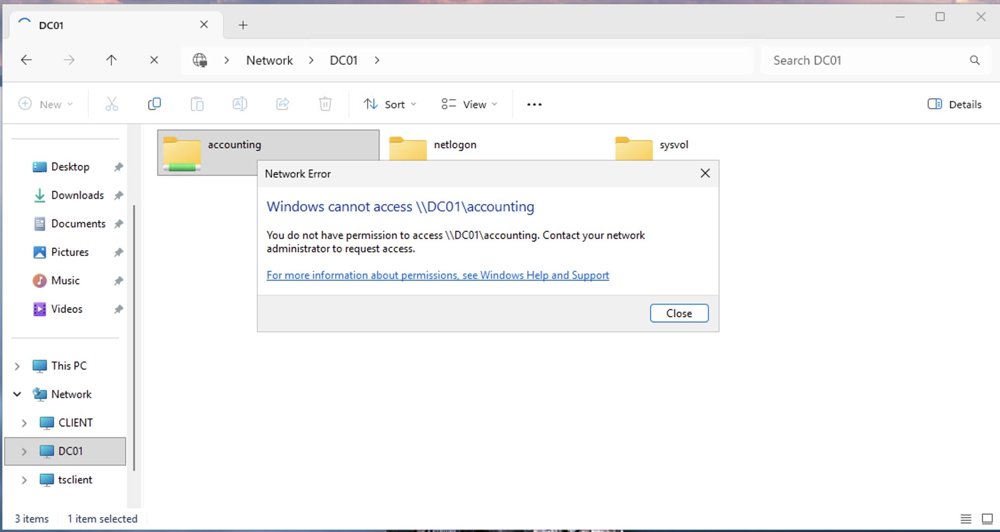

In this stage, the <b>ACCOUNTANTS</b> group can be added to the shared folder permissions for the <b>accounting</b> directory.

Once the group is assigned the correct permission level, any user added to the <b>ACCOUNTANTS</b> group will automatically receive the same level of access.

This means administrators do not need to manually configure folder permissions for each employee individually.

  

<h3>Testing Access Through Group Membership</h3>

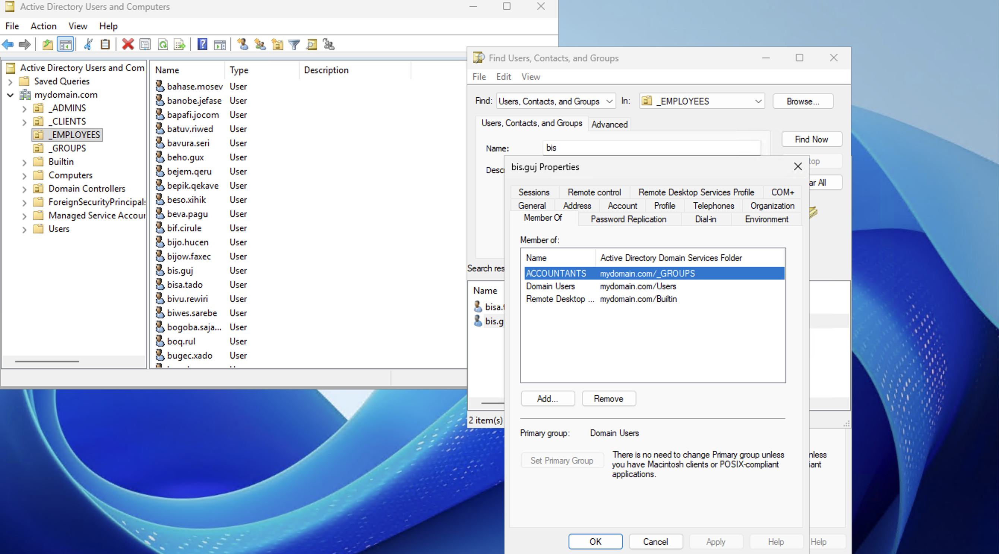

After the security group has been assigned to the folder permissions, users who belong to the <b>ACCOUNTANTS</b> group will be able to access the shared folder.

If a user is removed from the group, their access will automatically be revoked the next time permissions are evaluated.

This demonstrates how Active Directory groups can be used to efficiently manage access to network resources such as shared folders, printers, and applications.

Using groups rather than assigning permissions directly to users is considered a best practice in enterprise environments because it keeps access control organized, scalable, and easier to maintain.

<h3>Assigning the ACCOUNTANTS Group to the Accounting Shared Folder</h3>

In this step, the <b>accounting</b> folder is being shared and access permissions are assigned to a specific Active Directory security group.

The group <b>ACCOUNTANTS</b> has been added to the list of users allowed to access the share. The permission level assigned is <b>Read/Write</b>, which allows members of the group to:

<ul>
<li>Open files</li>
<li>Create new files</li>
<li>Edit existing files</li>
<li>Save changes inside the folder</li>
</ul>

Administrators are automatically listed as <b>Owner</b>, which means they have full control over the shared folder. This includes the ability to modify permissions, delete files, and manage access.

Using security groups like <b>ACCOUNTANTS</b> instead of assigning permissions to individual users makes access management significantly easier in enterprise environments. When a new employee joins the accounting department, administrators simply add the user to the group and the permissions are automatically applied.

  

<h3>Attempting to Access the Accounting Share Without Proper Group Membership</h3>

Next, the user attempts to open the shared folder from another machine through the network path:

<pre>\\DC01\accounting</pre>

Windows displays a network error message stating that access to the folder is denied.

This occurs because the current user account has not yet been added to the <b>ACCOUNTANTS</b> security group. Since the folder permissions only allow access to that group, users outside of the group are blocked.

This demonstrates how group-based permissions restrict access to network resources and enforce proper access control policies.

  

<h3>Adding a User to the ACCOUNTANTS Security Group</h3>

To grant access, the administrator opens <b>Active Directory Users and Computers</b> and locates the user account <b>bis.guj</b>.

Inside the user’s properties window, the <b>Member Of</b> tab shows the groups the user currently belongs to.

The user has now been added to the <b>ACCOUNTANTS</b> group, which resides in the <b>_GROUPS</b> organizational unit.

Once this change is applied, the user automatically inherits the permissions assigned to the group.

This is a fundamental concept in Active Directory permission management: users gain access to resources through group membership rather than being granted permissions directly.

  

<h3>Verifying Membership Inside the ACCOUNTANTS Group</h3>

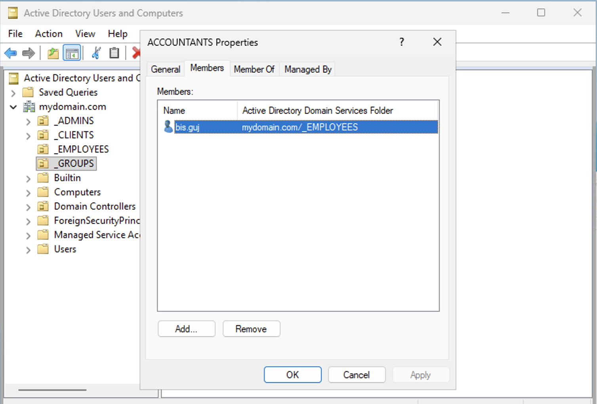

The properties of the <b>ACCOUNTANTS</b> group are opened to verify its members.

Under the <b>Members</b> tab, the user <b>bis.guj</b> is now listed as a member of the group.

This confirms that the user should inherit the permissions associated with the accounting shared folder.

Group membership changes may require the user to log off and log back in for the new permissions to fully apply because Windows caches authentication tokens at login time.

  

<h3>Confirming the Logged-In User Account</h3>

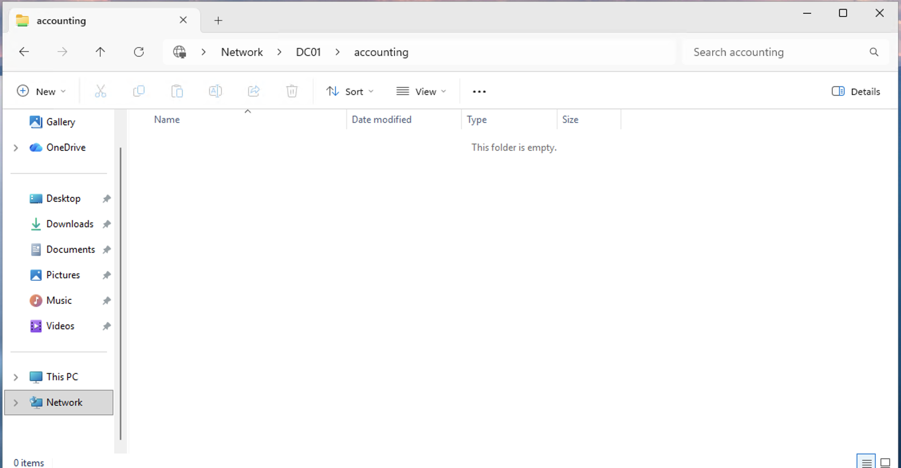

To confirm the identity of the currently logged-in user, the <b>whoami</b> command is executed in PowerShell.

<pre>whoami</pre>

The output shows:

<pre>mydomain\bis.guj</pre>

This verifies that the active session belongs to the user account that was just added to the <b>ACCOUNTANTS</b> security group.

This step helps ensure that the correct user is being used to test the folder permissions.

  

<h3>Successfully Accessing the Accounting Shared Folder</h3>

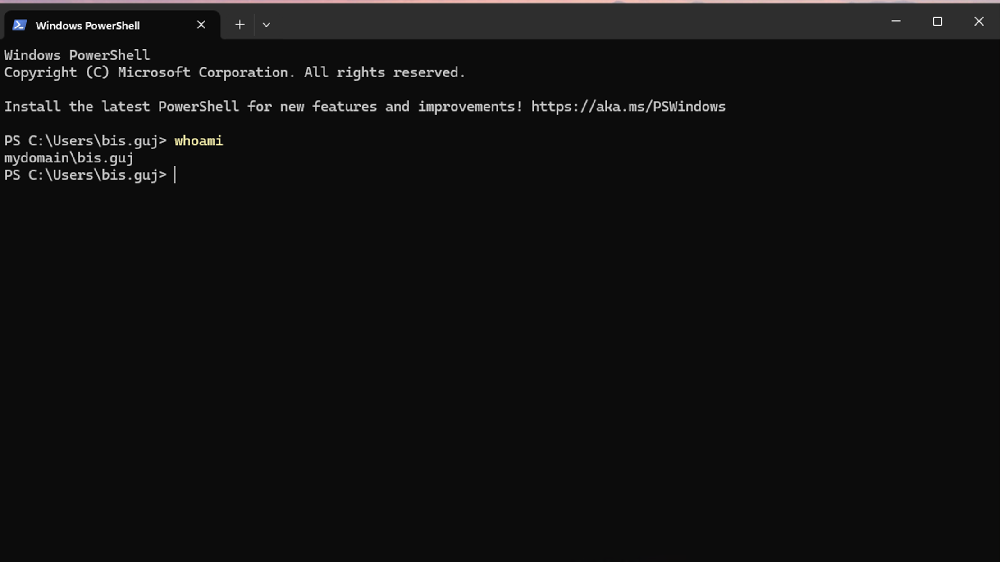

After the user has been added to the correct group, the shared folder is opened again using the network path:

<pre>Network &gt; DC01 &gt; accounting</pre>

This time the folder opens successfully without any permission errors.

The directory appears empty because no files have been created yet. However, the important result is that the user now has the ability to access the folder.

  

<h3>Creating and Editing a File in the Shared Folder</h3>

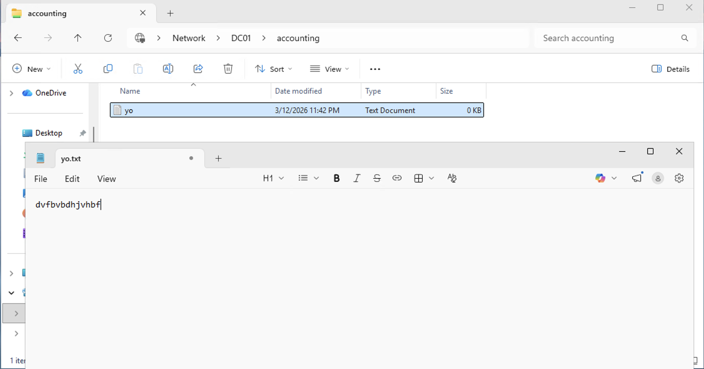

To confirm that write permissions are functioning correctly, a new text file named <b>yo.txt</b> is created inside the accounting shared folder.

The file is opened and text is written inside it, demonstrating that the user can:

<ul>
<li>Create files</li>
<li>Modify file contents</li>
<li>Save changes inside the shared directory</li>
</ul>

This confirms that the permissions assigned to the <b>ACCOUNTANTS</b> group are working as expected.

Because the user <b>bis.guj</b> is a member of the group, they inherit the <b>Read/Write</b> permissions that were assigned to the shared folder.

This final step demonstrates how Active Directory security groups simplify access management for shared resources in a domain environment.

